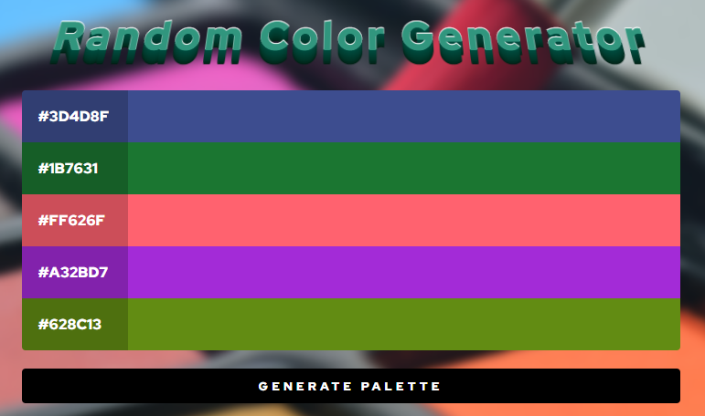

This code is a small application that generates a color palette in hexadecimal format.

First define a container in the HTML with the id `palleteContainer` where the colors will be displayed, then also uses an input of type `range` with id `colorRange` to adjust the number of dynamically generated colors. With an array called `colorValues` that contains the necessary digits and letters, generates colors in hexadecimal format, set the pallet size to `PALLETE_SIZE`, which in this case is 5.
The `createPallete()` function creates the palette. Clears the container, then creates divs for each color and adds them to the container. the `colorize(element)` function is responsible for assigning a random color to each element in the palette. Generates a random color in hexadecimal format and applies it as the background of the element, and also displays the hexadecimal code inside the element. The `updatePallete()` function updates all colors in the palette by calling `colorize()` for each element in the container, finally, `createPallete()` is called to generate the palette when the page loads.

🔗 <a href="https://marceloadan73.github.io/Hexadecimal-Color-Generator/">See in operation</a>
